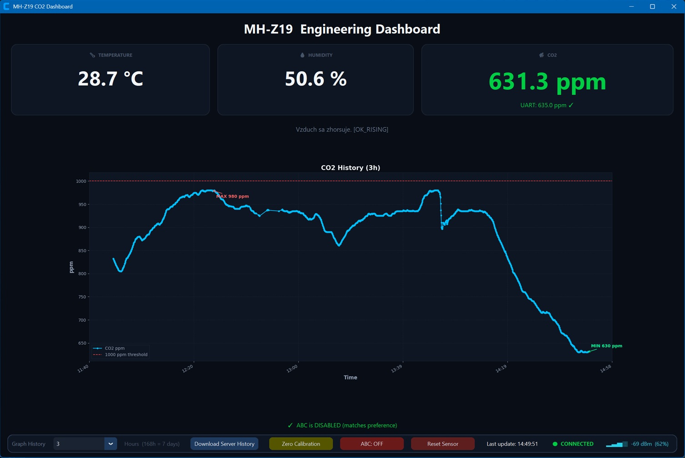

# MH-Z19 Engineering Air Quality Monitoring System

A complete engineering-grade CO2 monitoring system based on:

* ESP8266 (NodeMCU)
* MH-Z19 CO2 sensor
* DHT22 temperature/humidity sensor
* Local Blynk server
* Windows Python dashboard

The system provides:

* Real-time CO2 monitoring
* Temperature and humidity monitoring
* Historical graphing
* CSV data logging
* Engineering diagnostics
* Recovery logic for unstable measurements
* Automatic reconnect handling
* Dark-theme desktop dashboard

---

# System Architecture

```text
MH-Z19 + DHT22
       │
       ▼
ESP8266 / NodeMCU
       │
       ▼
Local Blynk Server (Raspberry Pi 5)
       │
       ▼
Windows Python Dashboard
```

---

# Components

## Hardware

### Main Controller

* ESP8266 NodeMCU

### Sensors

* MH-Z19 CO2 sensor
* DHT22 temperature/humidity sensor

### Indicators

* Green LED
* Orange LED
* Red LED

### Optional Recommended Components

* 100nF ceramic capacitor near MH-Z19 VCC/GND
* 47–220uF electrolytic capacitor near sensor supply
* Additional capacitor near fan supply

---

# ESP8266 Firmware

File:

```text
sensorValue6.ino
```

## Features

### Sensor Monitoring

* CO2 via MH-Z19 PWM output
* Temperature via DHT22
* Humidity via DHT22

### Engineering Protection Layers

The firmware implements a multi-layer protection architecture:

| Layer                       | Purpose                                  |
| --------------------------- | ---------------------------------------- |
| PWM synchronization         | Prevent partial pulse reads              |
| Full-cycle validation       | Detect corrupted timing                  |
| Rate-of-change rejection    | Reject impossible ppm jumps              |
| WiFi coexistence protection | Avoid WiFi timing corruption             |
| ABC recovery logic          | Handle MH-Z19 recalibration disturbances |
| Daily baseline validation   | Detect implausible baseline drift        |

---

# Diagnostic States

The firmware appends diagnostic states to Slovak status messages.

## Stable States

| State            | Meaning                   |
| ---------------- | ------------------------- |
| `[OK]`           | Normal stable operation   |
| `[OK_RECOVERED]` | Recovery from instability |
| `[BOOT]`         | Startup stabilization     |

## Error / Recovery States

| State               | Meaning                            |
| ------------------- | ---------------------------------- |
| `[PWM_INVALID]`     | Invalid PWM timing                 |
| `[HIGH_TIMEOUT]`    | HIGH pulse timeout                 |
| `[LOW_TIMEOUT]`     | LOW pulse timeout                  |
| `[PPM_RANGE]`       | Impossible ppm value               |
| `[RATE_REJECT]`     | Impossible ppm jump rejected       |
| `[RATE_RECOVERY]`   | Automatic deadlock recovery        |
| `[ABC_RECOVERY]`    | MH-Z19 ABC disturbance suppression |
| `[SENSOR_RECOVERY]` | Temporary fallback stabilization   |
| `[WIFI_LOST]`       | WiFi disconnected                  |
| `[BLYNK_LOST]`      | Blynk disconnected                 |
| `[WIFI_RECONNECT]`  | Reconnection in progress           |

---

# Blynk Virtual Pins

| Virtual Pin | Purpose             |
| ----------- | ------------------- |
| V10         | Temperature         |
| V11         | Humidity            |
| V12         | CO2 ppm             |
| V3          | Engineering message |

---

# Local Blynk Server

The project uses an older local Blynk server version running on Raspberry Pi 5.

Example configuration:

```cpp
char server[] = "192.168.xxx.xxx";
#define MY_BLYNK_PORT 8084
```

---

# Windows Dashboard

File:

```text
dashboard.py
```
or included Windows executable 
```text
dashboard.exe
```
Note: The executable is a packaged version of the Python script. Both files require `secrets.h` to be in the same directory.

## Features

### Live Dashboard

* Temperature display
* Humidity display
* CO2 ppm display
* Engineering diagnostic messages

### Historical Graph

Supported ranges:

* 1 hour
* 3 hours
* 24 hours
* 48 hours
* 7 days

### Logging

Two log files are generated from real-time sensor data pulled from the Blynk server:

| File                  | Purpose                        |
| --------------------- | ------------------------------ |
| `co2_log.csv`         | Historical sensor values       |
| `engineering_log.txt` | Diagnostic and connection logs |

### Historical Data Output from Blynk Server

Two historical CO2 sensor data files generated from the historical data (binary format) pulled from the Blynk server:

| File  (example file name)                       | Purpose                                               |
| ----------------------------------------------- | ----------------------------------------------------- |
| `blynk_history_co2_20260528_202749.txt`         | Historical CO2 data from Blynk server in TXT format   |
| `blynk_history_export_20260528_202749.csv`      | Historical CO2 data from Blynk server in CSV format   |

### Dark Theme

* Engineering-style dark UI
* Dark matplotlib graph
* White axis labels and ticks
* High-contrast visibility

---

# Required Python Packages

Install dependencies:

```bash
pip install requests pandas matplotlib customtkinter numpy
```
or
```bash
pip install -r requirements.txt
```

---

# Project Structure

```text
project_folder/
│
├── dashboard.py
├── dashboard.exe
├── sensorValue6.ino
├── secrets.h
├── co2_log.csv
├── requirements.txt
└── README.md
```

---

# secrets.h

Create a file named:

```text
secrets.h
```

Example:

```cpp
#pragma once

#define WIFI_SSID   "YourWiFi"
#define WIFI_PASS   "YourPassword"
#define BLYNK_AUTH  "YourAuthToken"
```

---

# Running the Dashboard

Start the dashboard:

```bash
python dashboard.py
```
or
```bash
dashboard.exe
```


<p align="center">
  
</p>


---

# Dashboard Features

## Live CO2 Graph

The dashboard automatically:

* logs measurements every cycle
* updates graph in real time
* supports selectable history ranges
* dynamically formats timestamps
* displays sparse data correctly

---

# CSV Logging Format

Example:

```csv
timestamp,temperature,humidity,co2,message
2026-05-26 17:29:04,27.61,42.81,810.0,"Vzduch sa zhorsuje. [OK]"
```

---

# Engineering TXT Log

Example:

```text
[2026-05-26 17:29:04] HTTP GET http://192.168.3.9:8084/...
[2026-05-26 17:29:04] PIN V12 RAW RESPONSE: ["810.000"]
[2026-05-26 17:29:04] Graph updated for 24h range
```

---

# CO2 Quality Thresholds

| CO2 ppm   | Quality         |
| --------- | --------------- |
| <1000     | Good            |
| 1000–1500 | Poor. Ventilate |
| >1500     | Critical        |

---

# LED Indicators

| LED    | Condition            |
| ------ | -------------------- |
| Green  | Good air             |
| Orange | Poor. Ventilate      |
| Red    | Critical air quality |

---

# Automatic Recovery Features

The firmware includes advanced recovery systems:

## Rate-Reject Recovery

Prevents permanent lockup after false spikes.

## ABC Recovery

Suppresses unstable MH-Z19 recalibration events.

## WiFi Recovery

Automatically reconnects WiFi and Blynk.

## Sensor Recovery

Maintains stable output during temporary invalid reads.

---

# Recommended Hardware Improvements

For maximum stability:

* add local decoupling capacitors
* avoid GPIO16 for PWM input
* separate fan airflow from direct sensor intake
* use stable 5V power supply
* avoid noisy USB power sources

---

# Known Engineering Notes

## MH-Z19 Startup Delay

The sensor may require several PWM cycles before reflecting environmental changes.

## WiFi Timing Interference

ESP8266 WiFi activity can disturb pulse timing measurements.

## ABC Recalibration

MH-Z19 automatic baseline calibration can temporarily produce unstable values around 24h uptime.

The firmware includes mitigation logic for these behaviors.

---

# Version

Dashboard (Windows EXE file):

```text
v1.8
```

Firmware (Arduino IDE):

```text
v. 5/28/2026 by AM
```

---

# License

Personal engineering / educational use.

This project is provided for educational and experimental purposes only and is supplied "as is" without warranty of any kind. Use at your own risk. The author assumes no liability for any damages, hardware failures, inaccurate measurements, data loss, or other consequences resulting from the use or misuse of this project.