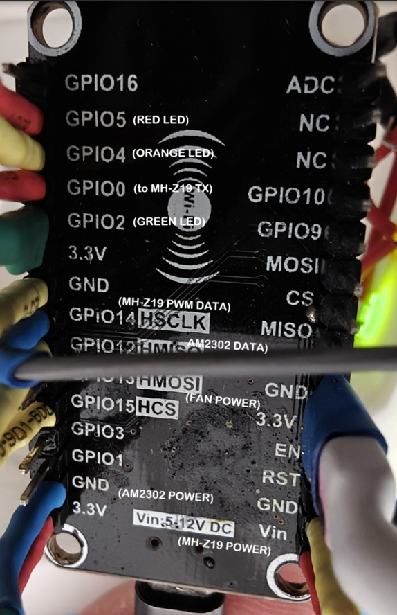
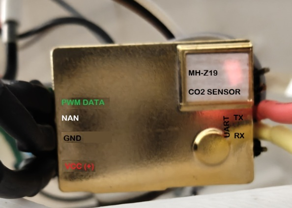
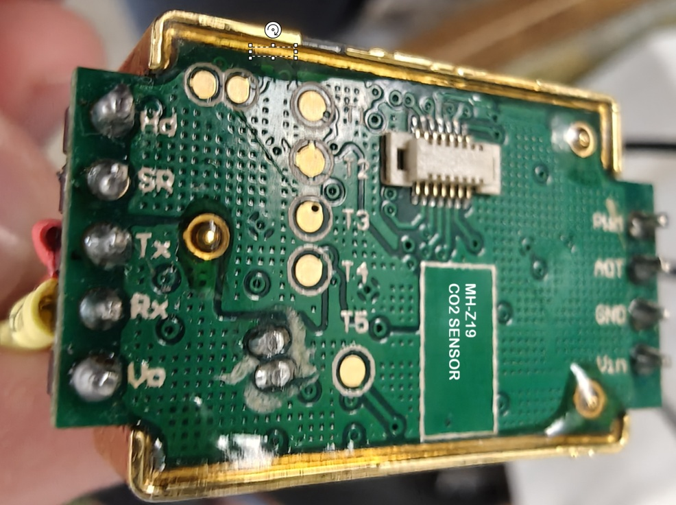
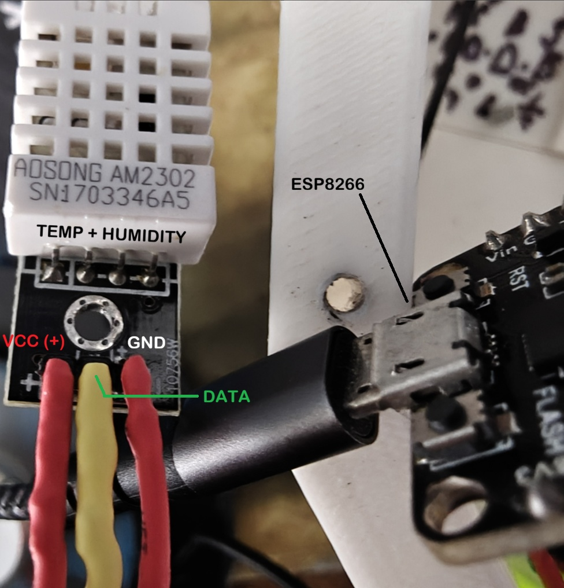

# MH-Z19 Engineering Air Quality Monitoring System

A complete engineering-grade CO2 monitoring system based on:

* ESP8266 (NodeMCU)
* MH-Z19 CO2 sensor
* DHT22 temperature/humidity sensor
* Local Blynk server
* Windows Python dashboard

The system provides:

* Real-time CO2 monitoring
* Temperature and humidity monitoring
* Historical graphing
* CSV data logging (including engineering messages)
* Engineering diagnostics
* Recovery logic for unstable measurements
* Automatic reconnect handling
* Dark-theme desktop dashboard
* WiFi RSSI monitoring (WiFi signal strength and quality)

---

# System Architecture

```text
MH-Z19 + DHT22
       │
       ▼
ESP8266 / NodeMCU
       │
       ▼
Local Blynk Server (Raspberry Pi 5)
       │
       ▼
Windows Python Dashboard
```

<p align="left">
  
</p>

<p align="left">
  
</p>

<p align="left">
  
</p>

<p align="left">
  
</p>

---

# Components

## Hardware

### Main Controller

* ESP8266 NodeMCU

### Sensors

* MH-Z19 CO2 sensor
* DHT22 temperature/humidity sensor

### Indicators

* Green LED
* Orange LED
* Red LED

### Optional Recommended Components

* 100nF ceramic capacitor near MH-Z19 VCC/GND
* 47–220uF electrolytic capacitor near sensor supply
* Additional capacitor near fan supply

### UART Cross-Check Wiring (v8)

The MH-Z19 simultaneously outputs both PWM and UART from its onboard processor.
No existing wires need to be changed. Two additional wires enable UART cross-check
and remote calibration control:

| MH-Z19 Pin | ESP8266 Pin   | Direction                | Purpose                  |
| ---------- | ------------- | ------------------------ | ------------------------ |
| TX         | GPIO0  (D3)   | MH-Z19 → ESP8266 → Blynk | UART data to firmware    |
| RX         | GPIO15 (D8)   | ESP8266 → MH-Z19         | Commands to sensor       |

> **Note:** GPIO15 has a 10k pull-down on the NodeMCU board. This is correct —
> it holds the pin LOW during boot (required boot mode) and does not interfere
> with SoftwareSerial TX after boot.
>
> The firmware works normally without these wires. If unconnected, all UART
> features are silently disabled and the dashboard calibration buttons remain
> gray automatically with no code change needed.

---

# ESP8266 Firmware

File:

```text
sensorValue6.ino
```

## Features

### Sensor Monitoring

* CO2 via MH-Z19 PWM output (primary)
* CO2 via MH-Z19 UART output (cross-check, v8)
* Temperature via DHT22
* Humidity via DHT22

### Calibration Control (v8)

* Zero-point calibration triggered remotely via Blynk V20
* ABC (Automatic Baseline Calibration) enable/disable via Blynk V21
* ABC state reported to dashboard every cycle so button stays in sync after restart

### Engineering Protection Layers

The firmware implements a multi-layer protection architecture:

| Layer | Name                          | Purpose                                          |
| ----- | ----------------------------- | ------------------------------------------------ |
| 1     | PWM synchronization           | Prevent partial pulse reads                      |
| 2     | Full-cycle validation         | Detect corrupted timing                          |
| 3     | Rate-of-change rejection      | Reject impossible ppm jumps                      |
| 4     | WiFi coexistence protection   | Avoid WiFi timing corruption                     |
| 5     | ABC recovery logic            | Handle MH-Z19 recalibration disturbances         |
| 6     | Daily baseline validation     | Detect implausible baseline drift                |
| 7     | Rolling median rejection      | Immune to single/double corrupted readings       |
| 8     | Stuck sensor detection        | Detect frozen PWM output (hardware fault)        |
| 9     | Fault latching                | Prevent rapid OK/FAULT state oscillation         |
| 10    | Adaptive plausibility limits  | Context-aware rate and smoothing thresholds      |
| 11    | Software watchdog restart     | Auto-restart after 5 min with no valid reading   |
| 12    | Adding offset to measured val | Send 3 x soft-reset then ESP.restart()           |

---

# Diagnostic States

The firmware appends diagnostic states to Slovak status messages.

## Stable States

| State            | Meaning                   |
| ---------------- | ------------------------- |
| `[OK]`           | Normal stable operation   |
| `[OK_RECOVERED]` | Recovery from instability |
| `[BOOT]`         | Startup stabilization     |

## Error / Recovery States

| State               | Meaning                                           |
| ------------------- | ------------------------------------------------- |
| `[PWM_INVALID]`     | Invalid PWM timing                                |
| `[HIGH_TIMEOUT]`    | HIGH pulse timeout                                |
| `[LOW_TIMEOUT]`     | LOW pulse timeout                                 |
| `[PPM_RANGE]`       | Impossible ppm value                              |
| `[RATE_REJECT]`     | Impossible ppm jump rejected                      |
| `[RATE_RECOVERY]`   | Automatic deadlock recovery                       |
| `[ABC_RECOVERY]`    | MH-Z19 ABC disturbance suppression                |
| `[SENSOR_RECOVERY]` | Temporary fallback stabilization                  |
| `[SENSOR_STUCK]`    | Sensor output frozen for 40 consecutive cycles    |
| `[FAULT_LATCHED]`   | Fault latch active — requires good reads to clear |
| `[WATCHDOG]`        | No valid reading for 5 min — restart imminent     |
| `[UART_CAL]`        | Zero calibration command just sent via UART       |
| `[WIFI_LOST]`       | WiFi disconnected                                 |
| `[BLYNK_LOST]`      | Blynk disconnected                                |
| `[WIFI_RECONNECT]`  | Reconnection in progress                          |
| `[OFFSET_FAULT]`    | Offset added to measured value sensed in data     |
| `[OFFSET_RECOVERY]` | Offset recovery from fault                        |

---

# Blynk Virtual Pins

| Virtual Pin | Direction      | Purpose                                                    |
| ----------- | -------------- | ---------------------------------------------------------- |
| V3          | Write          | Engineering message (Slovak + diagnostic state)            |
| V10         | Write          | Temperature (smoothed)                                     |
| V11         | Write          | Humidity (smoothed)                                        |
| V12         | Write          | CO2 ppm (PWM smoothed, primary)                            |
| V13         | Write          | CO2 ppm (UART raw, cross-check) — written only on success  |
| V20         | Read (handler) | Zero calibration trigger — write 1 to trigger              |
| V21         | Read+Write     | ABC state — written each cycle; write 1=enable / 0=disable |

> **V13 absence detection:** If the UART wires are not connected, V13 is never
> written. The dashboard reads `None` for V13 and keeps calibration buttons
> gray/disabled automatically.

---

# Local Blynk Server

The project uses an older local Blynk server version running on Raspberry Pi 5.

Example configuration:

```cpp
char server[] = "192.168.xxx.xxx";
#define MY_BLYNK_PORT 8084
```

---

# Windows Dashboard

File:

```text
dashboard.py
```
or included Windows executable 
```text
dashboard.exe
```
Note: The executable is a packaged version of the Python script. Both files require `secrets.h` to be in the same directory.

## Features

### Live Dashboard

* Temperature display
* Humidity display
* CO2 ppm display with colour coding by air quality level
* Engineering diagnostic messages
* Live connection status indicator (`CONNECTED` / `OFFLINE`)
* Last successful update timestamp
* All 5 HTTP calls run in a background thread, the UI stays responsive
* Check WiFi signal strength and quality
* Save last 7 days of data in TXT and CSV files
* Download all data from the server (contain data even if app is not run)

### Calibration Controls (v8)

Three buttons are available in the bottom bar next to the history selector:

| Button                  | Behaviour                                                                    |
| ----------------------- | ---------------------------------------------------------------------------- |
| Download Server History | Downloads historical data stored on the Blynk server                         |
| Zero Calibration        | Shows confirmation dialog, then sends zero-cal command via V20               |
| ABC                     | Toggles ABC on/off via V21. Colour indicates current state (see table below) |

**ABC button states:**

| Colour | Label     | Meaning                                           |
| ------ | --------- | ------------------------------------------------- |
| Gray   | `ABC: ?`  | UART wires not connected or state not yet queried |
| Green  | `ABC: ON` | ABC currently enabled                             |
| Red    | `ABC: OFF`| ABC currently disabled                            |

The Zero Calibration and ABC buttons are **automatically disabled (gray)** until
the firmware begins writing V13 (UART CO2). This detects whether the two UART
wires have been physically connected without any manual configuration.

### UART CO2 Cross-Check Display (v8)

A small label below the main CO2 value shows the UART reading each cycle:

| Display                         | Meaning                                  |
| ------------------------------- | ---------------------------------------- |
| `UART: N/A`                     | V13 not available (wires not connected)  |
| `UART: not wired`               | UART confirmed absent                    |
| `UART: 847.3 ppm ✓`             | Within 50 ppm threshold — agreement      |
| `UART: 902.1 ppm  ⚠ Δ+55`      | Significant difference — warning shown   |

### Historical Graph

Supported ranges:

* 1 hour
* 3 hours
* 24 hours
* 48 hours
* 7 days

### Logging

Two log files are generated from real-time sensor data pulled from the Blynk server:

| File                  | Purpose                        |
| --------------------- | ------------------------------ |
| `co2_log.csv`         | Historical sensor values       |
| `engineering_log.txt` | Diagnostic and connection logs |

### Historical Data Output from Blynk Server

Two historical CO2 sensor data files generated from the historical data (binary format) pulled from the Blynk server:
UPDATE: latest version saves also messages (text data) which are saved in:
`opt/blynk/data/user-email/history_1234567891_0_v3_text.txt`

| File  (example file name)                       | Purpose                                               |
| ----------------------------------------------- | ----------------------------------------------------- |
| `blynk_history_co2_20260528_202749.txt`         | Historical CO2 data from Blynk server in TXT format   |
| `blynk_history_export_20260528_202749.csv`      | Historical CO2 data from Blynk server in CSV format   |

### Dark Theme

* Engineering-style dark UI
* Dark matplotlib graph
* White axis labels and ticks
* High-contrast visibility

---

# Required Python Packages

Install dependencies:

```bash
pip install requests pandas matplotlib customtkinter numpy
```
or
```bash
pip install -r requirements.txt
```

---

# Project Structure

```text
project_folder/
│
├── dashboard.py
├── dashboard.exe
├── abc_preference.txt
├── sensorValue6.ino
├── secrets.h
├── co2_log.csv
├── requirements.txt
└── README.md
```

> Generated at runtime: `engineering_log.txt`, `blynk_history_*.txt`, `blynk_history_export_*.csv`
> Needs to exist at runtime:  `abc_preference.txt`

---

# secrets.h

Create a file named:

```text
secrets.h
```

Example:

```cpp
#pragma once

#define WIFI_SSID    "YourWiFi"
#define WIFI_PASS    "YourPassword"
#define BLYNK_AUTH   "YourAuthToken"
#define BLYNK_SERVER "xxx.xxx.xxx.xxx"
```

---

# Running the Dashboard

Start the dashboard:

```bash
python dashboard.py
```
or
```bash
dashboard.exe
```


<p align="center">
  
</p>


---

# Dashboard Features

## Live CO2 Graph

The dashboard automatically:

* logs measurements every cycle
* updates graph in real time
* supports selectable history ranges
* dynamically formats timestamps
* displays sparse data correctly

---

# CSV Logging Format

Example:

```csv
timestamp,temperature,humidity,co2,message
2026-05-26 17:29:04,27.61,42.81,810.0,"Vzduch sa zhorsuje. [OK]"
```

---

# Engineering TXT Log

Example:

```text
[2026-05-26 17:29:04] HTTP GET http://192.168.3.9:8084/...
[2026-05-26 17:29:04] PIN V12 RAW RESPONSE: ["810.000"]
[2026-05-26 17:29:04] Graph updated for 24h range
```

---

# CO2 Quality Thresholds

| CO2 ppm     | Quality              | Dashboard Colour | LED    |
| ----------- | -------------------- | ---------------- | ------ |
| < 800       | Good                 | Green            | Green  |
| 800 – 1000  | Moderate             | Yellow           | Green  |
| 1000 – 1500 | Poor — ventilate     | Orange           | Orange |
| > 1500      | Critical             | Red              | Red    |

A dashed red reference line is drawn at 1000 ppm on the dashboard graph.

---

# LED Indicators

| LED    | Condition            |
| ------ | -------------------- |
| Green  | Good air             |
| Orange | Poor. Ventilate      |
| Red    | Critical air quality |

---

# Automatic Recovery Features

The firmware includes advanced recovery systems:

## Rate-Reject Recovery

Prevents permanent lockup after false spikes.

## ABC Recovery

Suppresses unstable MH-Z19 recalibration events.

## WiFi Recovery

Automatically reconnects WiFi and Blynk.

## Sensor Recovery

Maintains stable output during temporary invalid reads.

---

# Recommended Hardware Improvements

For maximum stability:

* add local decoupling capacitors
* avoid GPIO16 for PWM input
* separate fan airflow from direct sensor intake
* use stable 5V power supply
* avoid noisy USB power sources

---

# Known Engineering Notes

## MH-Z19 Startup Delay

The sensor may require several PWM cycles before reflecting environmental changes.

## WiFi Timing Interference

ESP8266 WiFi activity can disturb pulse timing measurements.

## ABC Recalibration

MH-Z19 automatic baseline calibration can temporarily produce unstable values around 24h uptime.

The firmware includes mitigation logic for these behaviors.

## Sensor Drift and Zero Calibration

The MH-Z19 PWM output can drift upward slowly over weeks. The root cause is typically
ABC operating without a clean outdoor-air baseline reference.

To recalibrate:

1. Place the sensor in fresh outdoor air
2. Leave running for at least 20 minutes
3. Click **Zero Calibration** in the dashboard and confirm the dialog
4. The firmware sends the UART zero-cal command and sets `[UART_CAL]` state

> This requires the two UART wires (GPIO13/GPIO15) to be physically connected.

## ABC Auto-Calibration Behaviour

ABC assumes the lowest CO2 reading seen in any 24-hour window is ~400 ppm (fresh air).
If the sensor is always in an occupied room without ventilation, ABC has no clean reference
and the baseline can drift upward over time. In this case, consider disabling ABC via the
dashboard button and performing periodic manual zero calibration instead.

## UART State After Power Cycle

`abcEnabled` resets to `true` on every power cycle (factory default). If ABC was
previously disabled via the dashboard, it must be disabled again after restart.
The dashboard ABC button will show the actual state reported by the firmware via V21.

---


### Advanced Dashboard Features

The current dashboard implementation additionally includes:

* Live connection status indicator (`CONNECTED` / `OFFLINE`)
* Last successful update timestamp
* Clickable graph inspection for historical sensor values
* CO2 threshold reference line at 1000 ppm
* Automatic min/max CO2 annotations for visible graph range
* Dynamic CO2 colour coding by air quality level
* Smart adaptive timestamp formatting
* Exactly 6 evenly spaced graph time ticks
* Automatic dark-theme reapplication after graph redraw
* Historical data export directly from the Blynk server
* Automatic gzip decompression support for old Blynk history responses
* Human-readable TXT exports from binary Blynk history storage
* CSV export of downloaded Blynk history
* Startup diagnostics and connectivity testing
* Detailed engineering TXT logging for HTTP requests and parsing operations

### Graph Interaction

The dashboard graph supports direct mouse interaction.

Clicking any point on the graph displays:

* Timestamp
* Temperature
* Humidity
* CO2 ppm value

The dashboard automatically finds the nearest logged data point to the click position.

### Historical Export Files

The dashboard can download historical sensor data stored internally on the Blynk server even if the dashboard was not running at the time.

Additional generated files may include:

| File Example | Purpose |
| --- | --- |
| `blynk_history_temperature_YYYYMMDD_HHMMSS.txt` | Human-readable temperature history |
| `blynk_history_humidity_YYYYMMDD_HHMMSS.txt` | Human-readable humidity history |
| `blynk_history_co2_YYYYMMDD_HHMMSS.txt` | Human-readable CO2 history |
| `blynk_history_export_YYYYMMDD_HHMMSS.csv` | Combined CSV export for all sensors |

### Dashboard Connection Diagnostics

The dashboard logs:

* HTTP request status codes
* Raw Blynk virtual pin responses
* Graph update cycles
* Parsing failures
* Connection failures
* Sensor download failures
* Startup diagnostics
* Historical export operations


# Industrial Protection Logic

The firmware implements additional industrial-style protection and validation systems designed to improve long-term stability of the MH-Z19 sensor under noisy real-world operating conditions.

These systems are intended to reduce:

* false ppm spikes
* corrupted PWM timing reads
* WiFi-induced measurement instability
* automatic baseline calibration disturbances
* deadlocked recovery states
* unstable startup behaviour
* graph corruption caused by invalid sensor values

## PWM Synchronization Protection

The firmware synchronizes to complete PWM cycles before calculating ppm values.

This prevents:

* partial pulse reads
* corrupted timing windows
* invalid duty-cycle calculations

## Full-Cycle Timing Validation

Every PWM measurement cycle is validated for:

* HIGH pulse timeout
* LOW pulse timeout
* impossible cycle duration
* corrupted pulse structure

Invalid cycles are rejected before ppm conversion.

## Rate-of-Change Rejection Logic

The firmware rejects physically impossible ppm jumps between consecutive readings.

Examples:

* sudden spikes caused by WiFi interrupts
* corrupted pulse timing
* transient electrical noise

This protection prevents graph corruption and unstable dashboard behaviour.

## Automatic Recovery State Machine

The firmware includes automatic multi-stage recovery handling.

Recovery modes include:

| Recovery Mode | Purpose |
| --- | --- |
| `RATE_RECOVERY` | Recover from repeated rejected spikes |
| `ABC_RECOVERY` | Stabilize after MH-Z19 automatic baseline recalibration |
| `SENSOR_RECOVERY` | Temporary fallback handling during unstable reads |
| `OK_RECOVERED` | Return-to-normal stabilization confirmation |

## WiFi Coexistence Protection

ESP8266 WiFi activity can interfere with precise PWM timing measurements.

The firmware includes timing mitigation logic to reduce:

* PWM jitter
* invalid pulse reads
* corrupted ppm calculations during RF activity

## Baseline Drift Validation

The firmware monitors long-term baseline behaviour to detect:

* unrealistic daily baseline shifts
* unstable recalibration events
* abnormal sensor drift

## Startup Stabilization Logic

During boot, the firmware enters a controlled stabilization phase before reporting normal operational status.

This avoids:

* invalid startup ppm values
* unstable warm-up measurements
* false alarms immediately after power-on

## Rolling Median Outlier Rejection (Layer 7)

A circular buffer of 5 raw samples is maintained. The median is computed each cycle
and used as the primary input to the smoother instead of the single raw reading.

Benefits:

* immune to single or double corrupted readings (WiFi spikes, ABC glitches)
* a real sustained CO2 change is reflected after 3 consecutive cycles at the new level
* consensus override allows large genuine changes to pass after 3 consecutive median agreements
* prevents permanent blocking of real ventilation events by the rate limiter

## Stuck Sensor Detection (Layer 8)

If the raw integer ppm reading is identical for 40 consecutive cycles (~3.3 minutes)
the sensor is declared stuck. The MH-Z19 always produces small natural NDIR variation
(±5–15 ppm) in a stable environment, so a perfectly frozen reading indicates hardware fault.

On `SENSOR_STUCK` the smoother holds its last value and the watchdog will restart the
device if the condition persists.

## Fault Latching (Layer 9)

Prevents rapid OK/FAULT state oscillation during intermittent noise bursts.

* fault latches after 5 consecutive bad readings
* latch clears only after 3 consecutive fully valid readings
* while latched, smoothing alpha is reduced to 0.05 to prevent stray readings corrupting the display

## Adaptive Plausibility Thresholds (Layer 10)

The rate-of-change limit is context-aware rather than fixed:

| Context                    | Limit  | Reason                          |
| -------------------------- | ------ | ------------------------------- |
| Boot / not yet stable      | 700    | sensor warming up               |
| ABC time window (20–28 h)  | 800    | known ABC jumps                 |
| Strong downward trend      | 700    | active ventilation              |
| After fault recovery       | 400    | be conservative                 |
| Normal operation           | 500    | nominal                         |

The smoothing alpha is also adaptive based on the confirmed delta:

| Delta        | Alpha | Behaviour          |
| ------------ | ----- | ------------------ |
| > 200 ppm    | 0.75  | Fast tracking      |
| > 50 ppm     | 0.55  | Medium             |
| > 20 ppm     | 0.40  | Moderate           |
| ≤ 20 ppm     | 0.25  | Heavy smoothing    |

## Software Watchdog Restart (Layer 11)

If no valid reading is accepted within 5 minutes the device logs the event and calls
`ESP.restart()`. This recovers from:

* PWM signal loss (cable fault, sensor power loss)
* sustained WiFi interference causing all readings to fail
* any software deadlock in the protection logic

The watchdog resets on every accepted measurement and does not fire during normal operation.

## UART Cross-Check and Calibration (v8)

The firmware reads CO2 via SoftwareSerial UART in parallel with the PWM path.

| Feature             | Description                                                          |
| ------------------- | -------------------------------------------------------------------- |
| Cross-check         | UART reading compared to PWM each cycle, delta logged to serial      |
| V13 reporting       | UART ppm written to Blynk only on valid read                         |
| Zero calibration    | Triggered remotely via V20; sends 9-byte UART command to sensor      |
| ABC control         | Enabled/disabled remotely via V21; state persisted across sessions   |
| Auto-detection      | Dashboard detects UART absent (V13 = None) and disables buttons      |

## Industrial Logging Philosophy

The system was designed using engineering-style diagnostics where failures are explicitly logged rather than silently ignored.

Diagnostic logging includes:

* sensor timing failures
* recovery state transitions
* WiFi reconnect attempts
* Blynk reconnect events
* parsing failures
* graph update diagnostics
* historical export diagnostics

## Serial Diagnostic Fields

The firmware prints a diagnostic block every 5 seconds over USB serial (115200 baud):

| Field  | Shows                                                           |
| ------ | --------------------------------------------------------------- |
| TEMP   | Smoothed temperature (°C)                                       |
| HUM    | Smoothed humidity (%)                                           |
| RAW    | Last accepted raw ppm (ppm5)                                    |
| SMTH   | Smoothed CO2 ppm                                                |
| LAST   | lastValidPPM — fallback anchor value                            |
| DMIN   | Daily minimum ppm                                               |
| ABC    | ABC recovery mode active (0/1)                                  |
| DIAG   | Current diagnostic state string                                 |
| ALPH   | Current adaptive smoothing alpha                                |
| RLIM   | Current adaptive rate-of-change limit (ppm)                     |
| MEDY   | Median buffer ready (0/1)                                       |
| MEDN   | Last computed median value                                      |
| MEDC   | Median consensus counter                                        |
| STCK   | Stuck counter / OK or STUCK                                     |
| FLTC   | Consecutive faults / OK or LATCHED                              |
| TFLT   | Lifetime total fault count                                      |
| TMRJ   | Lifetime median-rejected spike count                            |
| WDGT   | Seconds since last valid reading / 300s limit                   |
| RATE   | Rate-reject consecutive counter                                 |
| UART   | Last UART CO2 reading (ppm), delta vs PWM; or -1 if not wired  |
| UABC   | ABC enable state: ON or OFF                                     |


# Version

Dashboard (Windows EXE file):

```text
v2.5
```

SensorValue6.ino (Firmware for Arduino IDE):

```text
6/28/2026 by AM
```

---

# License

Personal engineering / educational use.

This project is provided for educational and experimental purposes only and is supplied "as is" without warranty of any kind. Use at your own risk. The author assumes no liability for any damages, hardware failures, inaccurate measurements, data loss, or other consequences resulting from the use or misuse of this project.